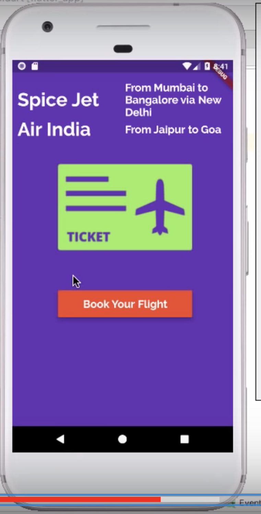
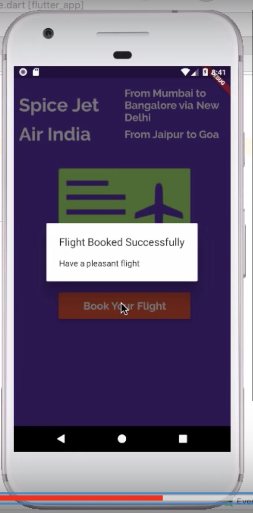
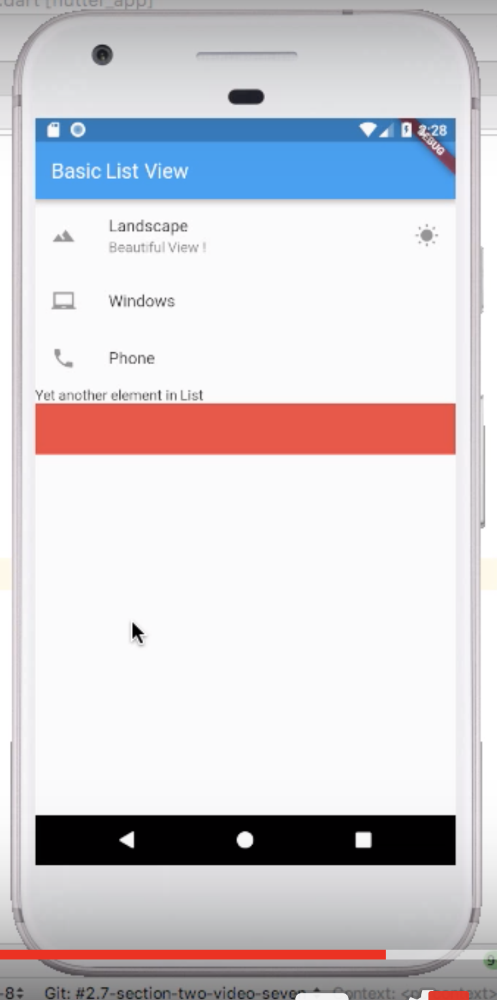
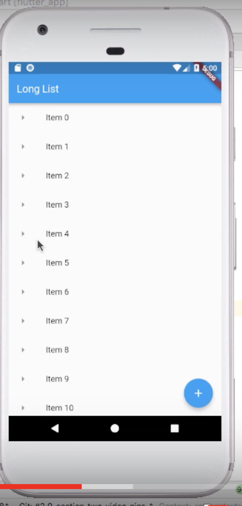
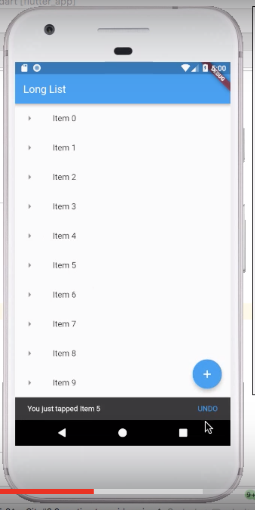

# Learning Flutter!

* Everything in Flutter is a Widget and a Widget is nothing more than a Dart class that extends a Flutter class.
* Widget classes have (usually) only one requirement: it must have a build method which returns other Widgets. The only exception to this rule is low-level widgets like 'Text' that return primitive types (Strings or numbers, usually.)

  Other than that, a widget is just a normal Dart class. You can add methods and properties and the like.
  ```dart
  class BigText extends StatelessWidget {
    // a property on this class
    final String text;

    // a constructor for this class
    BigText(this.text);

    Widget build(context) {
      // Pass the text down to another widget
      return new Text(
        text,
        // Even changing font-style is done through a Dart class.
        textStyle: new TextStyle(fontSize: 20.0),
      );
    }
  }
  // Then somewhere else in an app you'd use the widget like this:

  // ...
  // This is how we'd use the BigText within another widget.
  child: new BigText('This string would render and be big'),
  // ...
  ```
* Material widgets are designed to look like Android apps and Cupertino like iOS.
* Flutter widgets must extend a handful of classes from the Flutter library. The two you'll use almost always are StatelessWidget and StatefulWidget.

  The difference is that one has a concept of state within the Widget and some built in methods that tells Flutter to re-render if that state changes.
  
  A Stateful Widget looks a bit different. It's actually two classes: the state object and the widget.

## Lesson 1

* Wrote these two files:
* main.dart
  ```dart
  import "package:flutter/material.dart";
  import './app_screens/first_screen.dart';

  void main() => runApp(new MyFlutterApp());

  class MyFlutterApp extends StatelessWidget {

    @override
    Widget build(BuildContext context) {
      return MaterialApp(
          debugShowCheckedModeBanner: false,
          title: "My Flutter App",
          home: Scaffold(
            appBar: AppBar(title: Text("My First App Screen"),),
            body: FirstScreen()
          )
      );
    }
  }
  ```
  And app_screens/first_screen.dart
  ```dart
  import 'dart:math';

  import 'package:flutter/material.dart';

  class FirstScreen extends StatelessWidget {

    @override
    Widget build(BuildContext context) {
      return Material(
        color: Colors.lightBlueAccent,
        child: Center(
          child: Text(
            generateLuckyNumber(),
            textDirection: TextDirection.ltr,
            style: TextStyle(color: Colors.white, fontSize: 40.0),
          ),
        ),
      );
    }

    String generateLuckyNumber() {

      var random = Random();
      int luckyNumber = random.nextInt(10);
      return "Your lucky number is $luckyNumber";
    }
  }
  ```
## Lesson 2
* main.dart
  ```dart
  import 'package:flutter/material.dart';
  import './app_screens/home.dart';

  void main() {
    runApp(MaterialApp(
      title: "Exploring UI widgets",
      home: Home(),
    ));
  }
  ```
  The other file
  ```dart
  import 'package:flutter/material.dart';

  class Home extends StatelessWidget {
    @override
    Widget build(BuildContext context) {
      return Center(
            child: Container(
              // for working with fonts, create a new folder at application root named 'fonts' then put your downloaded fonts there and add their details in pubspec.yaml. Note: for regular font there is no need to define weight but for italic and bold find weight when downloading the font and mention their style as well (not need for regular font)
              // If we hadn't used Center widget then these width and height settings wouldn't work. But after using Center they would work, also margin is distance between two widgets and padding is like distance from boundary. Similary we have EdgeInsets.all() to get margin/padding from everywhere
    //		    width: 200.0,
    //		    height: 100.0,
    //		    margin: EdgeInsets.only(left: 35.0, top: 50.0),
              // added padding to get space for text. 
              padding: EdgeInsets.only(left: 10.0, top: 40.0),
              alignment: Alignment.center,
              color: Colors.deepPurple,
              // Better than column is list as with column you might get errors as of overflowing (screen hight not sufficient).
              child: Column(
                // Column is like |r1|
                //                |r2|
                //                |r3|
                // Whereas row is like |c1-c2-c3|
                // Our text was too big to get fit and therefore we started using expanded.
                children: <Widget>[
                  Row(
                    children: <Widget>[
                      Expanded(
                          child: Text(
                        "Spice Jet",
                        textDirection: TextDirection.ltr,
                        style: TextStyle(
                            decoration: TextDecoration.none,
                            fontSize: 35.0,
                            fontFamily: 'Raleway',
                            fontWeight: FontWeight.w700,
                            color: Colors.white),
                      )),
                      Expanded(
                          child: Text(
                        "From Mumbai to Bangalore via New Delhi",
                        textDirection: TextDirection.ltr,
                        style: TextStyle(
                            decoration: TextDecoration.none,
                            fontSize: 20.0,
                            fontFamily: 'Raleway',
                            fontWeight: FontWeight.w700,
                            color: Colors.white),
                      )),
                    ],
                  ),
                  Row(
                    children: <Widget>[
                      Expanded(
                          child: Text(
                        "Air India",
                        textDirection: TextDirection.ltr,
                        style: TextStyle(
                            decoration: TextDecoration.none,
                            fontSize: 35.0,
                            fontFamily: 'Raleway',
                            fontWeight: FontWeight.w700,
                            color: Colors.white),
                      )),
                      Expanded(
                          child: Text(
                        "From Jaipur to Goa",
                        textDirection: TextDirection.ltr,
                        style: TextStyle(
                            decoration: TextDecoration.none,
                            fontSize: 20.0,
                            fontFamily: 'Raleway',
                            fontWeight: FontWeight.w700,
                            color: Colors.white),
                      )),
                    ],
                  ),
                  FlightImageAsset(),
                  FlightBookButton()
                ],
              )));
    }
  }
  // Adding an image is simple! Just create folder images like fonts and put your images there and enter the details in that pubspec.yaml file.
  class FlightImageAsset extends StatelessWidget {

    @override
    Widget build(BuildContext context) {
      AssetImage assetImage = AssetImage('images/flight.png');
      Image image = Image(image: assetImage, width: 250.0, height: 250.0,);
      return Container(child: image,);
    }
  }
  // book button
  class FlightBookButton extends StatelessWidget {
    @override
    Widget build(BuildContext context) {
      return Container(
        // space from other widget
        margin: EdgeInsets.only(top: 30.0),
        // defining the containers size
        width: 250.0,
        height: 50.0,
        child: RaisedButton(
            color: Colors.deepOrange,
            child: Text(
              "Book Your Flight",
              style: TextStyle(
                  fontSize: 20.0,
                  color: Colors.white,
                  fontFamily: 'Raleway',
                  fontWeight: FontWeight.w700),
            ),
            // will make button look like its elevated from the container (putting the appropriate shadow)
            elevation: 6.0,
            onPressed: () => bookFlight(context)),
      );
    }

    void bookFlight(BuildContext context) {
      var alertDialog = AlertDialog(
        title: Text("Flight Booked Successfully"),
        content: Text("Have a pleasant flight"),
      );

      showDialog(
          context: context,
          builder: (BuildContext context) => alertDialog);
    }
  }
  ```
  Output:

  
  
* Basic List View. Notes:-
  * Meant for small number of items as it loads all the items in memory when attached to the screen.
  * Always wrap ListView as 'home' of 'Scaffold' widget as it is scrollable and might overflow beyond the screen 
  * Example code:
  ```dart
  void main() {
    runApp(MaterialApp(
      title: "Exploring UI widgets",
      home: Scaffold(
        appBar: AppBar(title: Text("Basic List View"),),
        body: getListView(),
      ),
    ));
  }

  Widget getListView() {

    var listView = ListView(
      children: <Widget>[

        ListTile(
          leading: Icon(Icons.landscape),
          title: Text("Landscape"),
          subtitle: Text("Beautiful View !"),
          trailing: Icon(Icons.wb_sunny),
          onTap: () {
            debugPrint("Landscape tapped"); // will just print on terminal
          },
        ),

        ListTile(
          leading: Icon(Icons.laptop_chromebook),
          title: Text("Windows"),
        ),

        ListTile(
          leading: Icon(Icons.phone),
          title: Text("Phone"),
        ),

        Text("Yet another element in List"),

        Container(color: Colors.red, height: 50.0,)

      ],
    );

    return listView;
  }

  ```
  Output:

  

* Implementing long lists
  ```dart
  void main() {
    runApp(MaterialApp(

      title: "Exploring UI widgets",

      home: Scaffold(
        appBar: AppBar(title: Text("Long List"),),
        body: getListView(),
        // Remember: 1 - Every Widget has its own build() and its context. 2 - The BuildContext is the parent of the widget returned by the build() method.
        // FAB is available only inside Scaffolds
        floatingActionButton: FloatingActionButton(
          onPressed: () {
            debugPrint("FAB clicked");
          },
          child: Icon(Icons.add),
          tooltip: 'Add One More Item', // will show after a long pressed on that button
        ),
      ),

    ));
  }

  void showSnackBar(BuildContext context, String item) {
    var snackBar = SnackBar(
      content: Text("You just tapped $item"),
      action: SnackBarAction(
          label: "UNDO",
          onPressed: () {
            debugPrint('Performing dummy UNDO operation');
          }
      ),
    );
    // like FAB snackbar needs context of our Scaffold
    Scaffold.of(context).showSnackBar(snackBar);
  }

  // preparing our data source
  List<String> getListElements() {

    var items = List<String>.generate(1000, (counter) => "Item $counter");
    return items;
  }

  Widget getListView() {

    var listItems = getListElements();

    // this is memory efficient as list will only be built for those items that can fit on screen
    var listView = ListView.builder(
        itemBuilder: (context, index) {

          return ListTile(
            leading: Icon(Icons.arrow_right),
            title: Text(listItems[index]),
            onTap: () {
              showSnackBar(context, listItems[index]);
            },
          );
        }
    );

    return listView;
  }
  ```

  Output:

  
  

## Lesson 3
* States, Dropdown and Forms!

  Basically after the change of state, older widget is destroyed and is recreated.
  
  ```dart
  import 'package:flutter/material.dart';

  void main() {
    runApp(MaterialApp(
      debugShowCheckedModeBanner: false,
      title: 'Simple Interest Calculator App',
      home: SIForm(),
      // making our theme
      theme: ThemeData(
          brightness: Brightness.dark, // will set the background
          primaryColor: Colors.indigo, 
          accentColor: Colors.indigoAccent), // will set the scroll limit hover color
    ));
  }

  class SIForm extends StatefulWidget {
    // Must override
    @override
    State<StatefulWidget> createState() {
      return _SIFormState();
    }
  }

  class _SIFormState extends State<SIForm> {

    var _formKey = GlobalKey<FormState>();

    var _currencies = ['Rupees', 'Dollars', 'Pounds'];
    final double _minimumPadding = 5.0;

    var _currentItemSelected = '';

    // can use initState to setup some values.
    @override
    void initState() {
      super.initState();
      _currentItemSelected = _currencies[0];
    }

    TextEditingController principalController = TextEditingController();
    TextEditingController roiController = TextEditingController();
    TextEditingController termController = TextEditingController();
    // three inputs, three controllers. Controllers help in getting back the value
    var displayResult = '';

    @override
    Widget build(BuildContext context) {
      TextStyle textStyle = Theme.of(context).textTheme.title;
      // getting our themes textStyle
      return Scaffold(
  //			resizeToAvoidBottomPadding: false,
        appBar: AppBar(
          title: Text('Simple Interest Calculator'),
        ),

        body: Form(
          key: _formKey,
          // margin not allowed in Form, so wrapped this in Padding
          child: Padding(
              padding: EdgeInsets.all(_minimumPadding * 2),
              child: ListView(
                children: <Widget>[
                  getImageAsset(),
                  Padding(
                      padding: EdgeInsets.only(
                          top: _minimumPadding, bottom: _minimumPadding),
                          // converted TextField -> (to) TextFromField
                      child: TextFormField(
                        keyboardType: TextInputType.number,
                        style: textStyle,
                        controller: principalController,
                        validator: (String value) {
                          // Checking
                          if (value.isEmpty) {
                            return 'Please enter principal amount';
                          }
                        },
                        decoration: InputDecoration(
                            labelText: 'Principal',
                            hintText: 'Enter Principal e.g. 12000',
                            labelStyle: textStyle,
                            // color for our error
                            errorStyle: TextStyle(
                              color: Colors.yellowAccent,
                              fontSize: 15.0
                            ),
                            // giving good border
                            border: OutlineInputBorder(
                                borderRadius: BorderRadius.circular(5.0))),
                      )),
                  Padding(
                      padding: EdgeInsets.only(
                          top: _minimumPadding, bottom: _minimumPadding),
                      child: TextFormField(
                        keyboardType: TextInputType.number,
                        style: textStyle,
                        controller: roiController,
                        validator: (String value) {
                          if (value.isEmpty) {
                            return 'Please enter rate of interest';
                          }
                        },
                        decoration: InputDecoration(
                            labelText: 'Rate of Interest',
                            hintText: 'In percent',
                            labelStyle: textStyle,
                            errorStyle: TextStyle(
                              color: Colors.yellowAccent,
                              fontSize: 15.0
                            ),
                            border: OutlineInputBorder(
                                borderRadius: BorderRadius.circular(5.0))),
                      )),
                  Padding(
                      padding: EdgeInsets.only(
                          top: _minimumPadding, bottom: _minimumPadding),
                      child: Row(
                        children: <Widget>[
                          Expanded(
                              child: TextFormField(
                            keyboardType: TextInputType.number,
                            style: textStyle,
                            controller: termController,
                            validator: (String value) {
                              if (value.isEmpty) {
                                return 'Please enter time';
                              }
                            },
                            decoration: InputDecoration(
                                labelText: 'Term',
                                hintText: 'Time in years',
                                labelStyle: textStyle,
                                errorStyle: TextStyle(
                                  color: Colors.yellowAccent,
                                  fontSize: 15.0
                                ),
                                border: OutlineInputBorder(
                                    borderRadius: BorderRadius.circular(5.0))),
                          )),
                          Container(
                            width: _minimumPadding * 5,
                          ),
                          Expanded(
                              child: DropdownButton<String>(
                // List.map will iterate over all the list items and executed the code
                            items: _currencies.map((String value) {
                              return DropdownMenuItem<String>(
                                value: value,
                                child: Text(value),
                              );
                            }).toList(),
                            value: _currentItemSelected,
                            onChanged: (String newValueSelected) {
                              // Your code to execute, when a menu item is selected from dropdown
                              // must setState
                              _onDropDownItemSelected(newValueSelected); // making our code modular :)
                            },
                          ))
                        ],
                      )),
                  Padding(
                      padding: EdgeInsets.only(
                          bottom: _minimumPadding, top: _minimumPadding),
                      child: Row(
                        children: <Widget>[
                          Expanded(
                            child: RaisedButton(
                              color: Theme.of(context).accentColor,
                              textColor: Theme.of(context).primaryColorDark,
                              child: Text(
                                'Calculate',
                                textScaleFactor: 1.5,
                              ),
                              onPressed: () {
                                setState(() {
                                  if (_formKey.currentState.validate()) {
                                    this.displayResult = _calculateTotalReturns();
                                  }
                                });
                              },
                            ),
                          ),
                          Expanded(
                            child: RaisedButton(
                              color: Theme.of(context).primaryColorDark,
                              textColor: Theme.of(context).primaryColorLight,
                              child: Text(
                                'Reset',
                                textScaleFactor: 1.5,
                              ),
                              onPressed: () {
                                setState(() {
                                  _reset();
                                });
                              },
                            ),
                          ),
                        ],
                      )),
                  Padding(
                    padding: EdgeInsets.all(_minimumPadding * 2),
                    child: Text(
                      this.displayResult,
                      style: textStyle,
                    ),
                  )
                ],
              )),
        ),
      );
    }

    Widget getImageAsset() {
      AssetImage assetImage = AssetImage('images/money.png');
      Image image = Image(
        image: assetImage,
        width: 125.0,
        height: 125.0,
      );

      return Container(
        child: image,
        margin: EdgeInsets.all(_minimumPadding * 10),
      );
    }

    void _onDropDownItemSelected(String newValueSelected) {
      setState(() {
        this._currentItemSelected = newValueSelected;
      });
    }

    String _calculateTotalReturns() {
      double principal = double.parse(principalController.text);
      double roi = double.parse(roiController.text);
      double term = double.parse(termController.text);

      double totalAmountPayable = principal + (principal * roi * term) / 100;

      String result =
          'After $term years, your investment will be worth $totalAmountPayable $_currentItemSelected';
      return result;
    }

    void _reset() {
      principalController.text = '';
      roiController.text = '';
      termController.text = '';
      displayResult = '';
      _currentItemSelected = _currencies[0];
    }
  }
  ```


* **Container widget**: A convenience widget that combines common painting, positioning, and sizing widgets.
* Container just has alignment (Align the child within the container like Alignment.center), child, constraints (additional constraints to apply to the **child**), **decoration** (The decoration to paint behind the child), **foregroundDecoration** (The decoration to pain in front of the child), margin (Empty space to surround the decoration of the child), padding (Empty space to inscribe inside the decoration. The child, if any, is placed inside this padding), transform (The transformation matrix to apply before painting the container), color (color of the container), width, height. 
* Container has **decoration** property which is absent in Scaffold, so it it better to wrap Scaffold insider Container.
* About Container's layout (imp):
  * If the widget has no child, no height, no width, no constraints, and the parent provides unbounded constraints, then Container tries to size as small as possible.

  * If the widget has no child and no alignment, but a height, width, or constraints are provided, then the Container tries to be as small as possible given the combination of those constraints and the parent's constraints.

  * If the widget has no child, no height, no width, no constraints, and no alignment, but the parent provides bounded constraints, then Container expands to fit the constraints provided by the parent.

  * If the widget has an alignment, and the parent provides unbounded constraints, then the Container tries to size itself around the child.

  * If the widget has an alignment, and the parent provides bounded constraints, then the Container tries to expand to fit the parent, and then positions the child within itself as per the alignment.

  * Otherwise, the widget has a child but no height, no width, no constraints, and no alignment, and the Container passes the constraints from the parent to the child and sizes itself to match the child.
* BoxDecoration has 
  * backgroundBlendMode - The blend mode applied to the color or gradient background of the box.
  * border - A border to draw above the background color, gradient, or image. 
  * borderRadius - If non-null, the corners of this box are rounded by this BorderRadius.
  * boxShadow - A list of shadows cast by this box behind the box. 
  * color - The color to fill in the background of the box. 
  * gradient - A gradient to use when filling the box. 
    * Can use LinearGradient which has begin, end, 2 colors and a tileMode.
    * TileMode enum defines what happens at the edge of the gradient.

      A gradient is defined along a finite inner area. In the case of a linear gradient, it's between the parallel lines that are orthogonal to the line drawn between two points. In the case of radial gradients, it's the disc that covers the circle centered on a particular point up to a given radius.

      This enum is used to define how the gradient should paint the regions outside that defined inner area.

      See more info [here](https://docs.flutter.io/flutter/dart-ui/TileMode-class.html)
  * image - An image to paint above the background color or gradient.
  * isComplex (bool) - Whether this decoration is complex enough to benefit from caching its painting.
  * padding - Returns the insets to apply when using this decoration on a box that has contents, so that the contents do not overlap the edges of the decoration. For example, if the decoration draws a frame around its edge, the padding would return the distance by which to inset the children so as to not overlap the frame.
  * shape - The shape to fill the background color, gradient, and image into and to cast as the boxShadow.
* Those apps like Youtube which have Bottom Navigation Bar can be implemented in Scaffold. But Bottom Navigation is best used when you have three to five top-level navigation items of similar importance. For more than 5 screens use Navigation Drawer.
* Its better to at least have a look at the properties of the following:
  * [IconButton](https://docs.flutter.io/flutter/material/IconButton-class.html)
  * https://docs.flutter.io/flutter/material/AppBar-class.html
  * https://docs.flutter.io/flutter/widgets/Positioned-class.html